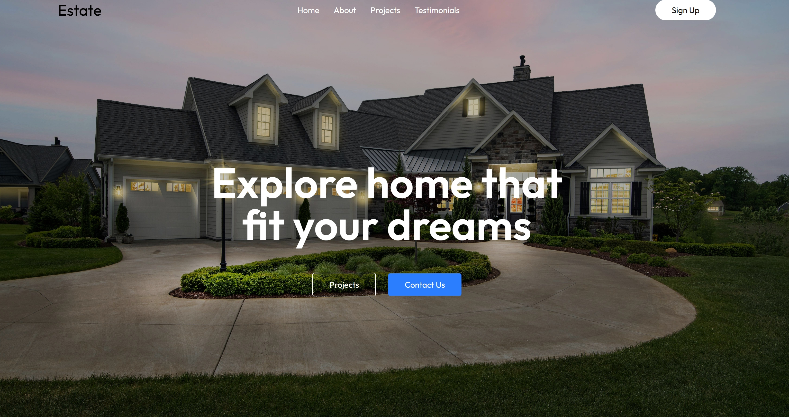
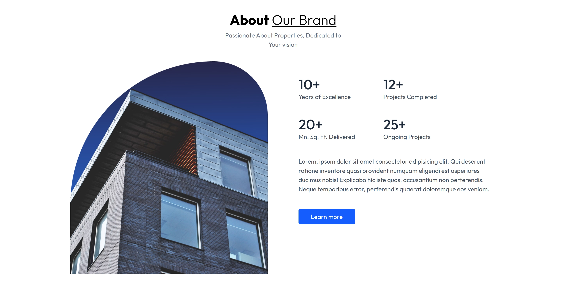
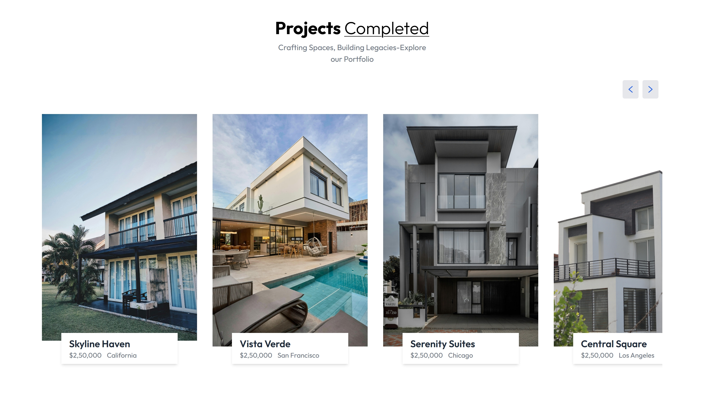
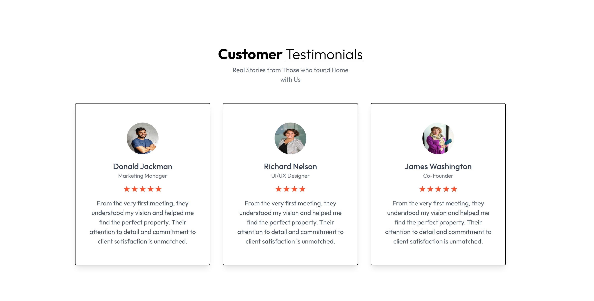

<h1>Real Estate UI - React + Tailwind CSS</h1>

A modern and responsive Real Estate Website UI built using React and Tailwind CSS.  
This project includes Home, About, Projects, and Testimonials Pages with a clean and professional design.

<h2>📌 Features</h2>

<h3>⭐ Home Page</h3>

<h4>Beautiful hero section</h4>  
<h4>Clean layout with CTA buttons</h4>  
Modern real estate theme

<h3>⭐ About Page</h3>

<h4>Details about the real estate agency</h4>  
<h4>Shows number of completed projects</h4>  
<h4>Styled information blocks</h4>

<h3>⭐ Projects Page</h3>

<h4>Displays all real estate projects</h4>  
<h4>Responsive grid layout</h4>  
<h4>Each project section has images</h4>

<h3>⭐ Testimonials Page</h3>

<h4>Real client reviews</h4>  
<h4>clean card based design</h4>

<h3>Tech Stack </h3>

React.js : Frontend framework  
Tailwind CSS : Styling & responsiveness  
Vite

License

This project is for learning and UI demonstration purposes.  
Feel free to use or modify it.
